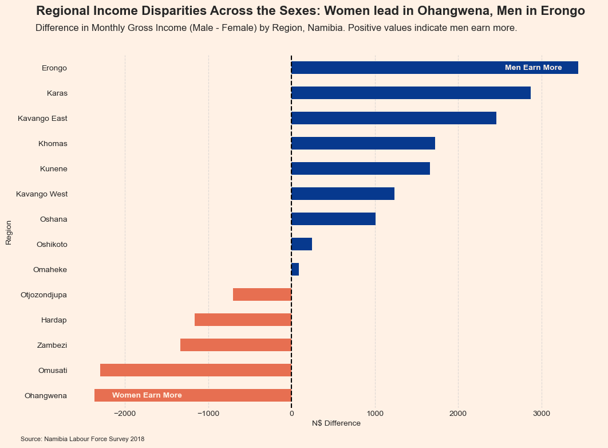
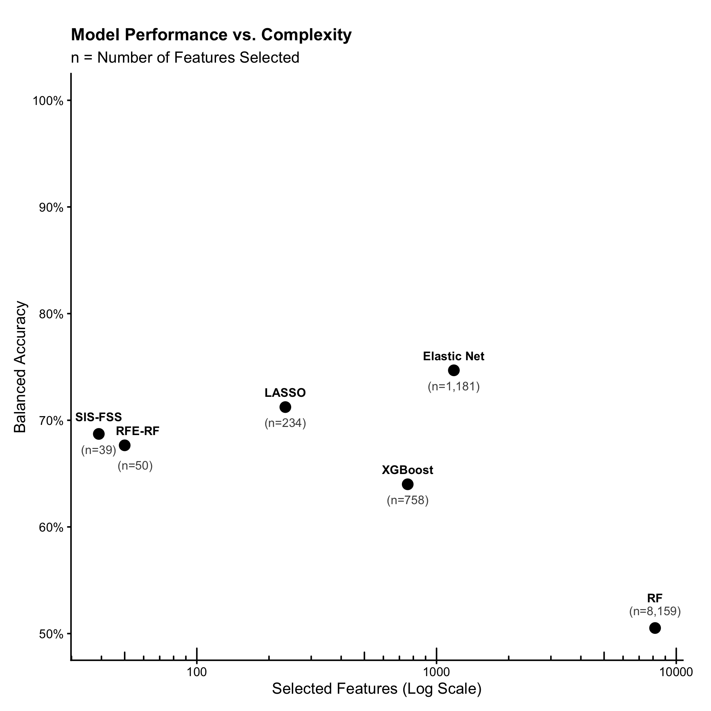

## Hi there 👋

Testing out the basics:
- git status
- git add . (Staging the photo)
- git commit -m "message" (Taking the picture)
- git push (Sharing the photo)

### Some plots:
**Visualising Income in Namibia**

From a Data Science for Public Policy project.

**Model Performance on a Neural IBL Dataset**

From a Machine Learning and Data Mining project, predicting mouse behaviour based on neural probe recordings. Testing feature selection methods in a noisy, temporally collinear, $n > p$ context with low-rank signals.

<!--
**coderadinho/coderadinho** is a ✨ _special_ ✨ repository because its `README.md` (this file) appears on your GitHub profile.

Here are some ideas to get you started:

- 🔭 I’m currently working on ...
- 🌱 I’m currently learning ...
- 👯 I’m looking to collaborate on ...
- 🤔 I’m looking for help with ...
- 💬 Ask me about ...
- 📫 How to reach me: ...
- 😄 Pronouns: ...
- ⚡ Fun fact: ...
-->
